# RagInProduction - Architektur-Dokumentation

Eine umfassende Dokumentation für neue Entwickler, um die Codebase schnell zu verstehen.

## Inhaltsverzeichnis

1. [Projektübersicht](#projektübersicht)
2. [Projektstruktur](#projektstruktur)
3. [Systemarchitektur](#systemarchitektur)
4. [Datenfluss](#datenfluss)
5. [Kernmodule](#kernmodule)
6. [WebSocket API](#websocket-api)
7. [Datenmodelle](#datenmodelle)
8. [PDF-Ingestion-Pipeline](#pdf-ingestion-pipeline)
9. [Azure AI Search Integration](#azure-ai-search-integration)
10. [Konfiguration](#konfiguration)
11. [Entwicklung & Testing](#entwicklung--testing)

---

## Projektübersicht

**RagInProduction** ist ein Retrieval Augmented Generation (RAG) System, das Azure AI Search für die Dokumentensuche mit OpenAI für Embeddings und Textgenerierung kombiniert.

### Kernfunktionen

- **Produkt-Suche**: Abfragen gegen eine Produktdatenbank
- **Dokument-Suche**: Persönliche Dokumente (PDFs wie Rechnungen, Quittungen, Tickets)
- **Intelligentes Routing**: Automatische Klassifizierung von Benutzeranfragen
- **Streaming-Antworten**: Echtzeit-Antwortgenerierung
- **Mehrsprachigkeit**: Deutsch und Englisch

### Technologie-Stack

| Komponente | Technologie |
|------------|-------------|
| Sprache | Python 3.14+ |
| Web Framework | FastAPI + WebSocket |
| LLM | OpenAI GPT-4o |
| Embeddings | text-embedding-3-small (1536 Dimensionen) |
| Vektor-Suche | Azure AI Search |
| PDF-Extraktion | Azure Document Intelligence |
| Multi-Agent Framework | AutoGen |
| Datenbank | SQLite (lokal) / Azure Cosmos DB (Produktion) |
| Audit Logs | SQLite oder Azure Cosmos DB (konfigurierbar) |

---

## Projektstruktur

```
RagInProduction/
├── src/
│   ├── main.py                           # CLI Entry Point
│   ├── api/
│   │   ├── __init__.py                   # FastAPI App Factory
│   │   └── controller/
│   │       └── chat_controller.py        # WebSocket Chat Controller
│   ├── rag/
│   │   └── chat/
│   │       ├── rag_chat.py               # RAG-Orchestrierung
│   │       └── question_triage.py        # Fragen-Klassifizierung
│   ├── clients/
│   │   ├── sqlite_client.py              # SQLite-Abstraktion
│   │   ├── cosmosdb_client.py            # Azure Cosmos DB Client
│   │   └── document_intelligence_client.py
│   ├── config/
│   │   └── configuration.py              # Konfigurationsverwaltung
│   ├── models/
│   │   ├── rag_log.py                    # Log-Datenmodell
│   │   ├── pdf_chunk.py                  # PDF-Chunk-Modell
│   │   ├── product.py                    # Produkt-Modell
│   │   └── document_tracker.py           # Dokument-Tracking
│   ├── services/
│   │   ├── rag_log_service.py            # Audit-Logging (SQLite/CosmosDB)
│   │   ├── document_tracking_service.py  # Deduplizierung
│   │   └── products_service.py           # Produkt-Service
│   ├── ingestion/
│   │   ├── pdf_ingestion.py              # PDF-Pipeline
│   │   ├── create_pdf_index.py           # Index-Erstellung
│   │   └── upload_sql_records_to_ai_search.py
│   └── evaluation/
│       └── run_evals.py                  # LLM-Evaluierung
├── tests/
│   ├── test_automated_evals.py
│   ├── test_document_tracking.py
│   ├── test_pdf_ingestion.py
│   ├── test_rag_log_service.py           # SQLite Backend Tests
│   └── test_cosmosdb_integration.py      # CosmosDB Integration Tests
├── config.yaml                           # Nicht-sensible Konfiguration
├── requirements.txt
└── CLAUDE.md
```

---

## Systemarchitektur

### High-Level Architektur

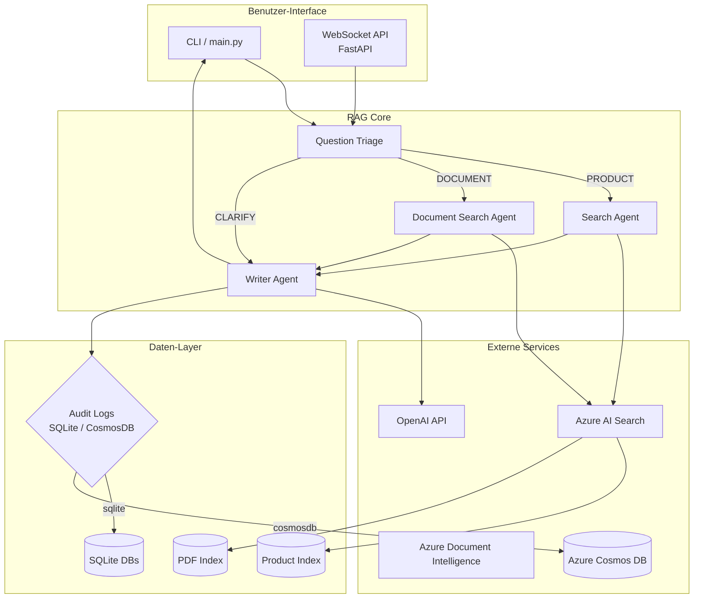

### Multi-Agent Architektur

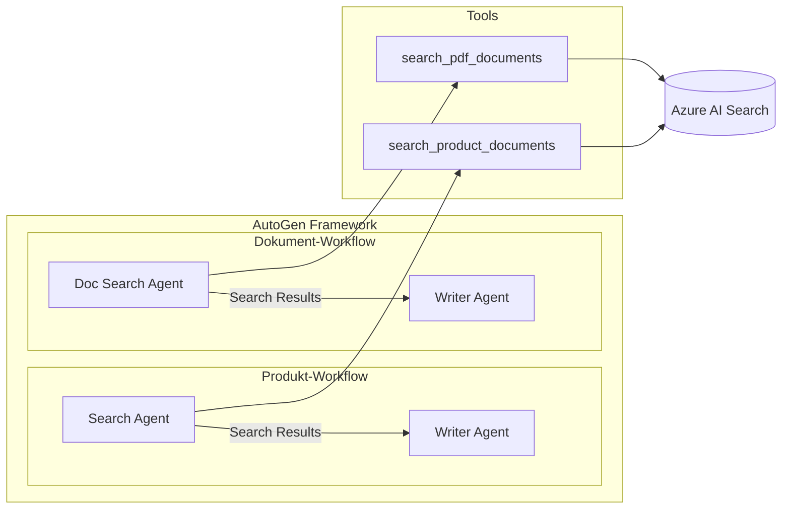

---

## Datenfluss

### Kompletter Anfrage-Ablauf

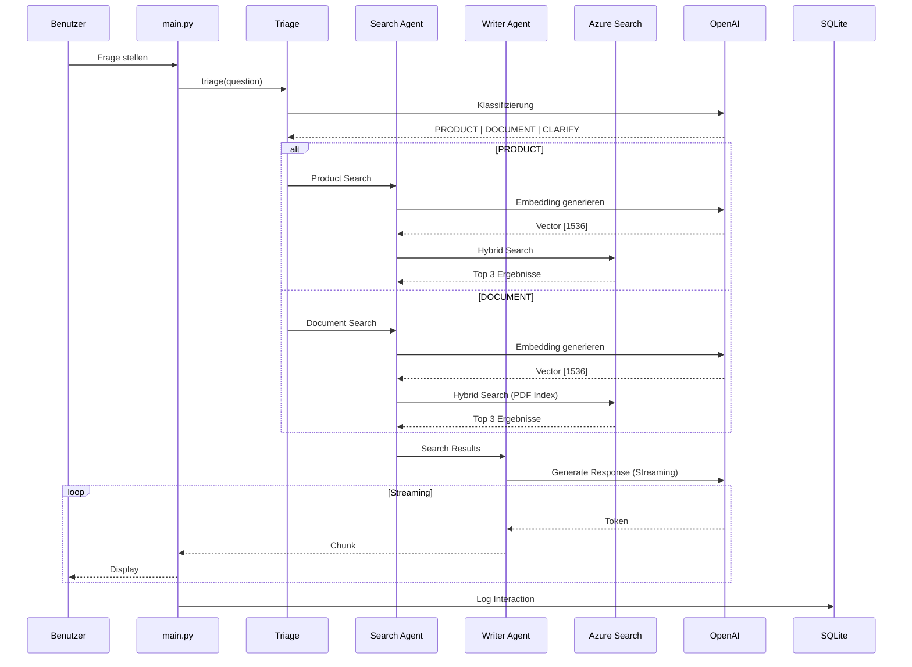

### Question Triage Entscheidungsbaum

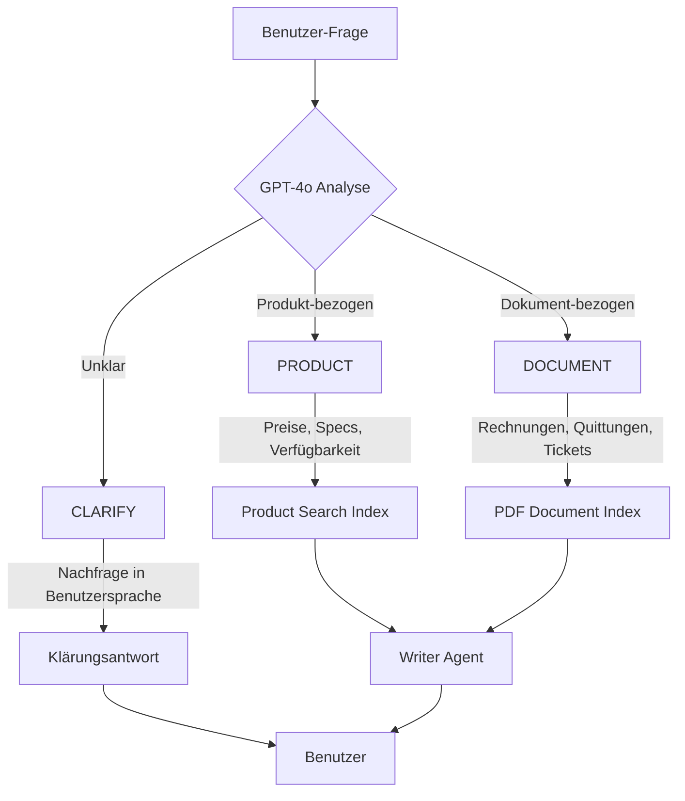

---

## Kernmodule

### 1. RAG Chat (`src/chat/rag_chat.py`)

Die zentrale Orchestrierungslogik für das RAG-System.

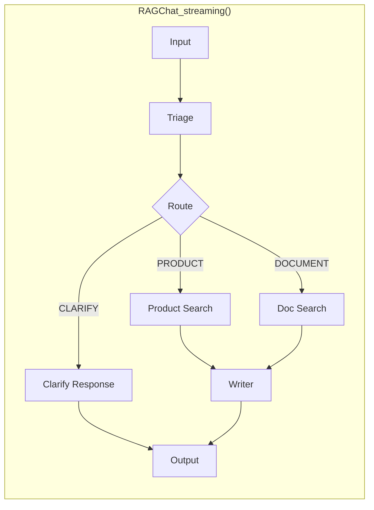

**Hauptfunktion:**
```python
async def RAGChat_streaming(
    chat_history: str,
    user_question: str,
    user_email: str
) -> AsyncGenerator[str, None]:
    """
    Führt RAG-Workflow aus und streamt die Antwort.

    Phasen:
    1. Question Triage (Klassifizierung)
    2. Search (Produkt oder Dokument)
    3. Generation (Streaming)
    """
```

### 2. Question Triage (`src/chat/question_triage.py`)

Klassifiziert Benutzeranfragen in drei Kategorien:

| Kategorie | Beschreibung | Beispiel |
|-----------|--------------|----------|
| `PRODUCT` | Produkt-bezogene Fragen | "Was kostet das Produkt X?" |
| `DOCUMENT` | Persönliche Dokumente | "Wie viel habe ich bei Amazon ausgegeben?" |
| `CLARIFY` | Unklare Anfragen | "Kannst du mir helfen?" |

### 3. SQLite Client (`src/clients/sqlite_client.py`)

Context-Manager für Datenbankoperationen:

```python
with SqliteClient("path.db") as client:
    client.execute_query(sql, params)
```

### 4. Cosmos DB Client (`src/clients/cosmosdb_client.py`)

Async Client für Azure Cosmos DB NoSQL API:

```python
async with CosmosDBClient(endpoint, key, db_name, container_name) as client:
    await client.upsert_item({"id": "123", "data": "value"})
    items = await client.query_items("SELECT * FROM c WHERE c.user = @user", params)
```

**Features:**
- Automatische Datenbank/Container-Erstellung
- Async Context Manager für sauberes Ressourcen-Management
- CRUD-Operationen: `upsert_item`, `read_item`, `query_items`, `delete_item`

### 5. RAG Log Service (`src/services/rag_log_service.py`)

Audit-Logging mit konfigurierbarem Backend:

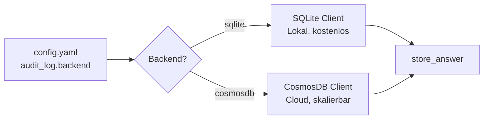

**Backend-Auswahl via `config.yaml`:**
```yaml
audit_log:
  backend: "sqlite"     # oder "cosmosdb"
  sqlite_path: "rag_logs.db"
```

### 6. Configuration (`src/config/configuration.py`)

Singleton-Pattern für Konfigurationsverwaltung:

```mermaid
flowchart LR
    ENV[.env] --> CONFIG[get_config()]
    YAML[config.yaml] --> CONFIG
    CONFIG --> APP[AppConfig]
    APP --> OPENAI[OpenAIConfig]
    APP --> AZURE[AzureAISearchConfig]
    APP --> DB[DatabaseConfig]
    APP --> AUDIT[AuditLogConfig]
    APP --> COSMOS[CosmosDBConfig?]
```

**Hinweis:** `CosmosDBConfig` wird nur geladen wenn `audit_log.backend = "cosmosdb"`

---

## WebSocket API

### Übersicht

Die WebSocket API ermöglicht Echtzeit-Streaming-Kommunikation mit dem RAG-System, ideal für Frontend-Integrationen (Angular, React, etc.).

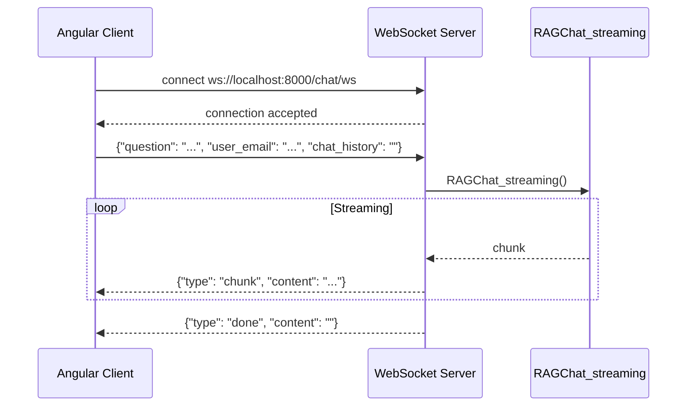

### Server starten

```bash
# Abhängigkeiten installieren (falls noch nicht geschehen)
pip install uvicorn[standard]

# WebSocket Server starten
uvicorn src.api:app --reload --host 0.0.0.0 --port 8000

# Mit spezifischer Umgebung
APP_ENV=dev uvicorn src.api:app --reload --port 8000
```

### Endpoints

| Endpoint | Typ | Beschreibung |
|----------|-----|--------------|
| `ws://localhost:8000/chat/ws` | WebSocket | Streaming RAG Chat |
| `GET /health` | HTTP | Health Check |

### Protokoll

**Client → Server (JSON):**
```json
{
  "question": "Was kostet das Produkt X?",
  "user_email": "user@example.com",
  "chat_history": ""
}
```

**Server → Client (JSON):**
```json
{"type": "chunk", "content": "Das Produkt X kostet"}
{"type": "chunk", "content": " 49,99 Euro."}
{"type": "done", "content": ""}
```

**Fehlerfall:**
```json
{"type": "error", "content": "Fehlerbeschreibung"}
```

### Angular Client Beispiel

```typescript
import { Injectable } from '@angular/core';
import { Subject, Observable } from 'rxjs';

@Injectable({ providedIn: 'root' })
export class ChatService {
  private ws: WebSocket | null = null;
  private messageSubject = new Subject<string>();

  connect(): void {
    this.ws = new WebSocket('ws://localhost:8000/chat/ws');

    this.ws.onmessage = (event) => {
      const response = JSON.parse(event.data);
      if (response.type === 'chunk') {
        this.messageSubject.next(response.content);
      } else if (response.type === 'done') {
        this.messageSubject.complete();
      } else if (response.type === 'error') {
        this.messageSubject.error(response.content);
      }
    };
  }

  sendQuestion(question: string, userEmail: string, chatHistory: string = ''): Observable<string> {
    this.messageSubject = new Subject<string>();

    this.ws?.send(JSON.stringify({
      question,
      user_email: userEmail,
      chat_history: chatHistory
    }));

    return this.messageSubject.asObservable();
  }

  disconnect(): void {
    this.ws?.close();
  }
}
```

### Architektur

```
src/api/
├── __init__.py              # FastAPI App Factory mit CORS
└── controller/
    ├── __init__.py          # Router Exports
    └── chat_controller.py   # WebSocket Endpoint
```

**Controller Pattern:** APIRouter für modulare Erweiterbarkeit

---

## Datenmodelle

### Übersicht der Datenmodelle

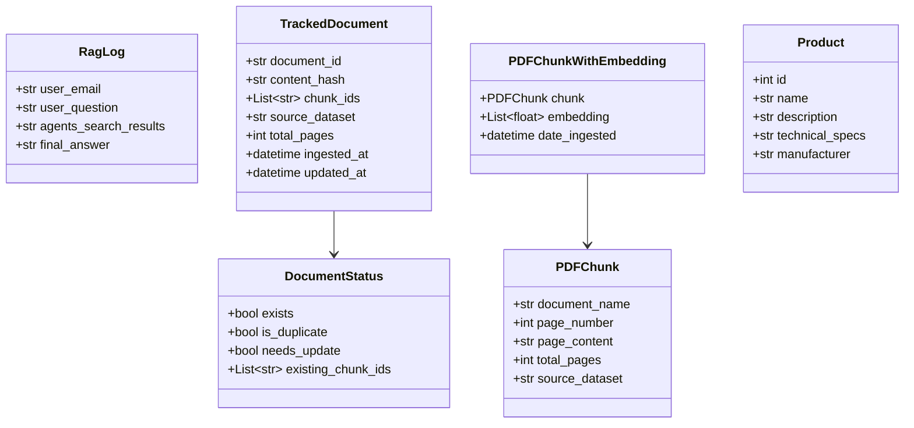

### SQLite Datenbank-Schemas

**rag_logs.db:**
```sql
CREATE TABLE raglogs (
    user_email TEXT,
    user_question TEXT,
    agents_search_results TEXT,
    final_answer TEXT,
    timestamp TEXT
);
```

**document_tracking.db:**
```sql
CREATE TABLE document_tracking (
    document_id TEXT PRIMARY KEY,
    content_hash TEXT NOT NULL,
    chunk_ids TEXT NOT NULL,      -- JSON Array
    source_dataset TEXT NOT NULL,
    total_pages INTEGER NOT NULL,
    ingested_at TEXT NOT NULL,
    updated_at TEXT NOT NULL
);

CREATE INDEX idx_content_hash ON document_tracking(content_hash);
```

---

## PDF-Ingestion-Pipeline

### Ingestion-Workflow

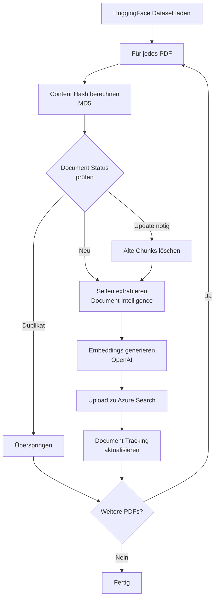

### Deduplizierungs-Logik

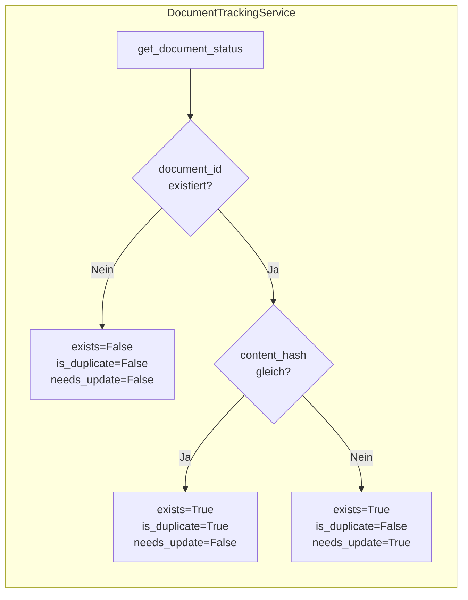

---

## Azure AI Search Integration

### Zwei Such-Indizes

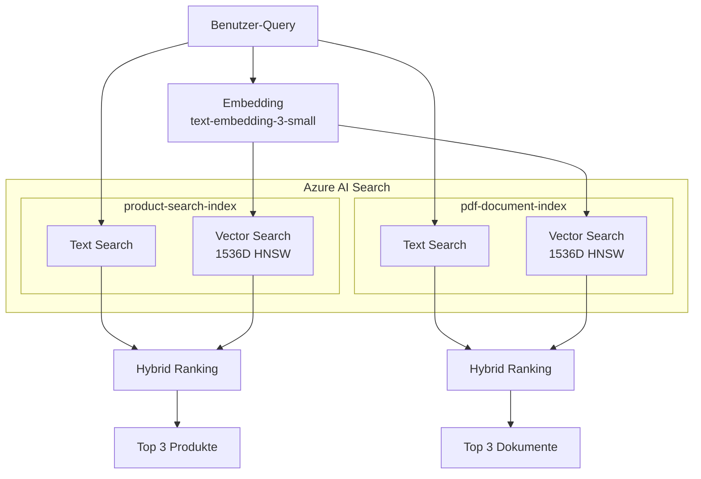

### PDF Index Schema

| Feld | Typ | Funktion |
|------|-----|----------|
| `id` | String (Key) | Deterministischer Hash |
| `document_name` | String | PDF-Dateiname |
| `page_number` | Int32 | Seitennummer |
| `page_content` | String | Extrahierter Text |
| `vector` | Float[1536] | Embedding-Vektor |
| `source_dataset` | String | Datenquelle |
| `total_pages` | Int32 | Gesamtseitenzahl |
| `date_ingested` | DateTime | Ingestion-Zeitpunkt |

---

## Konfiguration

### Umgebungsspezifische Konfiguration

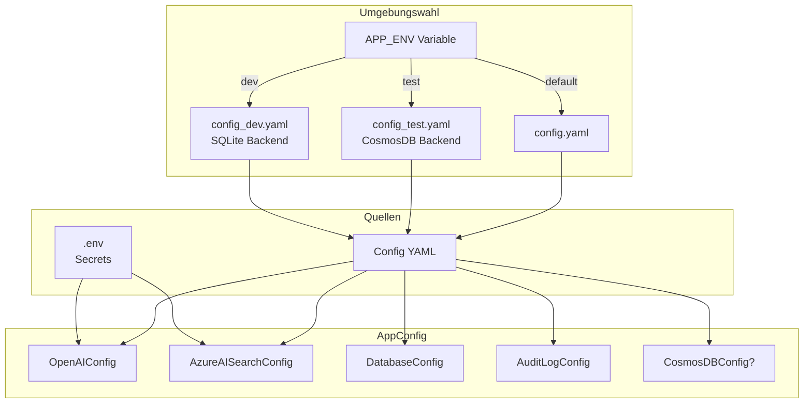

| Umgebung | Config-Datei | Audit Backend | Verwendung |
|----------|--------------|---------------|------------|
| `APP_ENV=dev` | `config_dev.yaml` | SQLite | Lokale Entwicklung |
| `APP_ENV=test` | `config_test.yaml` | CosmosDB | Produktions-Tests |
| Default | `config.yaml` | Konfiguriert | Fallback |

### Erforderliche Umgebungsvariablen

```bash
# .env Datei
OPENAI_API_KEY=sk-...           # OpenAI API Key
AI_SEARCH_KEY=...               # Azure Search API Key
AI_SEARCH_NAME=...              # Azure Search Service Name
AI_SEARCH_ENDPOINT=https://...  # Azure Search Endpoint
DOCUMENT_INTELLIGENCE_KEY=...   # Azure Doc Intel Key

# Nur bei audit_log.backend = "cosmosdb":
COSMOSDB_ENDPOINT=https://...   # Cosmos DB Account Endpoint
COSMOSDB_KEY=...                # Cosmos DB Account Key
```

### config.yaml Beispiel

```yaml
openai:
  model: "gpt-4o"
  embedding_model:
    name: "text-embedding-3-small"
    dimensions: 1536

ai_search:
  index_name: "product-search-index"
  pdf_index_name: "pdf-document-index"
  endpoint: "https://product-search-engine.search.windows.net"

document_intelligence:
  endpoint: "https://azure-document-idp.cognitiveservices.azure.com/"
  model_id: "prebuilt-layout"

database:
  path: "products.db"
  document_tracking_path: "document_tracking.db"

# Audit Log Backend Toggle
audit_log:
  backend: "sqlite"              # "sqlite" (lokal) oder "cosmosdb" (produktion)
  sqlite_path: "rag_logs.db"

# Nur wenn audit_log.backend = "cosmosdb"
cosmosdb:
  database_name: "ragchat_info"
  container_name: "ragchat_logs"
  partition_key_path: "/id"
```

---

## Entwicklung & Testing

### Entwicklungsumgebung einrichten

```bash
# 1. Repository klonen
git clone <repo-url>
cd RagInProduction

# 2. Virtual Environment erstellen
python -m venv venv
source venv/bin/activate  # Linux/Mac
# oder: venv\Scripts\activate  # Windows

# 3. Abhängigkeiten installieren
pip install -r requirements.txt

# 4. .env Datei erstellen
cp .env.example .env
# API-Keys eintragen
```

### Befehle

```bash
# WebSocket API Server starten (für Angular/Frontend)
uvicorn src.api:app --reload --host 0.0.0.0 --port 8000

# WebSocket Server mit spezifischer Umgebung
APP_ENV=dev uvicorn src.api:app --reload --port 8000

# Interaktiven CLI Chat starten
python src/main.py

# CLI mit spezifischer Umgebung starten
APP_ENV=dev python src/main.py   # SQLite Backend
APP_ENV=test python src/main.py  # CosmosDB Backend

# PDF-Index erstellen
python src/ingestion/create_pdf_index.py

# PDFs ingesten
python src/ingestion/pdf_ingestion.py

# Alle Tests ausführen (Entwicklung mit SQLite)
APP_ENV=dev pytest -s

# Tests mit CosmosDB Backend
APP_ENV=test pytest -s

# Einzelnen Test ausführen
pytest tests/test_document_tracking.py::TestDocumentTrackingService -s
```

### Test-Struktur

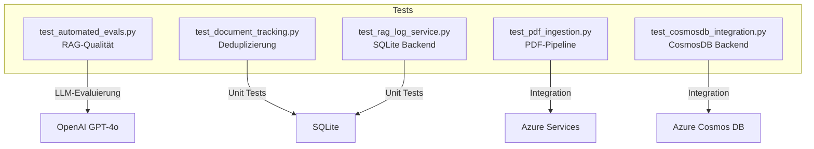

**Test-Kategorien:**
- `test_rag_log_service.py`: Läuft immer (keine externen Abhängigkeiten)
- `test_cosmosdb_integration.py`: Wird übersprungen ohne `COSMOSDB_*` Env-Vars

### Wichtige Konstanten

| Konstante | Wert | Beschreibung |
|-----------|------|--------------|
| `SEARCH_TOP_K` | 3 | Anzahl der Suchergebnisse |
| `VECTOR_K_NEAREST_NEIGHBORS` | 3 | KNN für Vektorsuche |
| `MAX_GROUP_CHAT_TURNS` | 8 | Max. Agent-Runden |
| `CHAT_TEMPERATURE` | 0 | Deterministische Antworten |
| Embedding Dimensionen | 1536 | text-embedding-3-small |

---

## Fehlerbehandlung

### Exception-Hierarchie

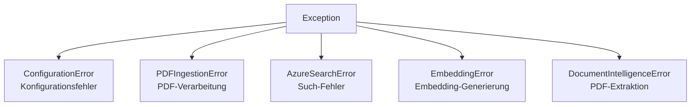

### Fehlerbehandlungs-Strategie

| Fehlertyp | Strategie | Beispiel |
|-----------|-----------|----------|
| Kritische Konfiguration | Fail Fast | Fehlender API-Key |
| Optionale Features | Log & Continue | Extraction Model |
| Externe Services | Graceful Degradation | API nicht erreichbar |
| Benutzer-bezogen | Freundliche Meldung | Ungültige Anfrage |

---

## Ressourcen-Management

### Context Manager Pattern

```python
# SQLite
with SqliteClient("path.db") as client:
    client.execute_query(sql, params)
# Automatische Verbindung schließen

# Document Tracking
with DocumentTrackingService("path.db") as service:
    service.register_document(...)
# Automatische Ressourcen-Freigabe

# Azure Search (Async)
async with search_client:
    results = await search_client.search(...)
# Automatische Client-Schließung

# CosmosDB (Async)
async with CosmosDBClient(endpoint, key, db, container) as client:
    await client.upsert_item(data)
# Automatische Verbindung schließen

# RAG Log Service (Async, beide Backends)
async with RagLogService() as service:
    await service.store_answer(rag_log)
# Backend-unabhängige Ressourcen-Freigabe
```

---

## Mehrsprachigkeit

Das System unterstützt Deutsch und Englisch vollständig:

1. **Question Triage**: Erkennt die Sprache der Frage
2. **Klärungsanfragen**: In der Sprache des Benutzers
3. **Writer Agent**: Antwortet in der Originalsprache
4. **Chat-Historie**: Wird in der Originalsprache geführt

**System-Prompt für Writer:**
> "CRITICAL: You MUST respond in the SAME LANGUAGE as the user's question.
> If the user asks in German, respond in German.
> If the user asks in English, respond in English."

---

## Zusammenfassung

RagInProduction ist ein produktionsreifes RAG-System mit:

- **WebSocket API** für Frontend-Integration (Angular, React, etc.)
- Multi-Source Dokumentensuche (Produkte + PDFs)
- Intelligentem Fragen-Routing via Triage
- Echtzeit-Streaming-Antworten
- **Konfigurierbarem Audit-Logging** (SQLite für Entwicklung, Cosmos DB für Produktion)
- Smarter Deduplizierung
- Mehrsprachiger Unterstützung (DE/EN)
- Async/Await-Architektur für hohe Parallelität
- Ordnungsgemäßer Ressourcen-Bereinigung via Context Manager

### Backend-Wechsel für Audit Logs

```yaml
# Entwicklung (kostenlos, lokal)
audit_log:
  backend: "sqlite"
  sqlite_path: "rag_logs.db"

# Produktion (skalierbar, cloud)
audit_log:
  backend: "cosmosdb"
```

Bei Fragen zur Architektur oder Implementierung, siehe die einzelnen Module und ihre Docstrings.
